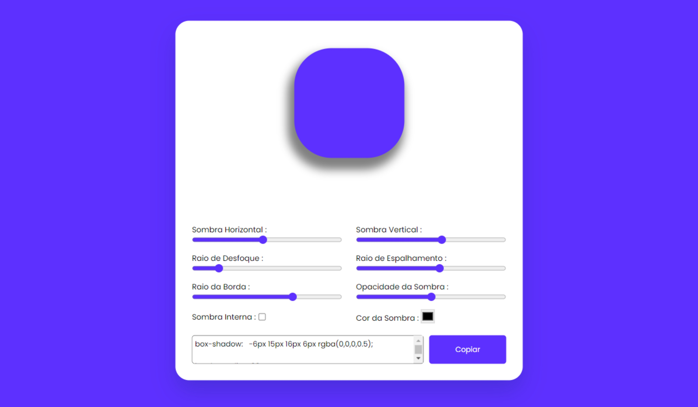

# Gerador de Box Shadow

## Sobre o projeto

Um apicativo simples capaz de gerar várias opções de box-shadow.

## Como utilizar

Basta modificar as opções de sombras, desfoque, opacidade e cor utilizando as barras de progresso. Também é possível copiar os estilos gerados por você.

## Informações

Projeto desenvolvido utilizando apenas HTML, CSS e JavaScript.

